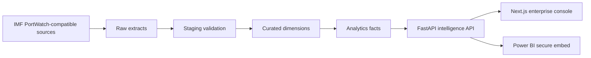

# CTRL SEA Enterprise Maritime Intelligence Deliverables

## Architecture



## Database Schema

Core dimensions: `DimCountry`, `DimPort`, `DimChokepoint`, `DimVessel`, `DimTradeRoute`, `DimIndustry`, `DimScenario`, `DimHazard`, `DimDisruptionEvent`.

Core facts: `FactDailyPorts`, `FactDailyChokepoints`, `FactDailyCongestion`, `FactTradeFlow`, `FactMonthlyTrade`, `FactClimateRisk`, `FactTradeRisk`, `FactDisruptions`, `FactSpilloverPort`, `FactSpilloverCountry`, `FactSupplyChain`.

ETL audit: `EtlRun`.

## Run Commands

Backend:

```powershell
cd ctrl-sea-backend
python -m venv .venv
.\.venv\Scripts\Activate.ps1
pip install -r requirements.txt
uvicorn app.main:app --reload --port 8000
```

Frontend:

```powershell
cd ctrl-sea-frontend
npm install
npm run dev
```

## Deployment

Set `NEXT_PUBLIC_API_URL` to the deployed FastAPI `/api` base URL. The maritime map uses OpenStreetMap tiles and requires no access token. Configure Power BI embedding with Azure AD service principal auth, workspace/report IDs, embed tokens, and row-level security roles.

## Roadmap

1. Replace demo payloads with scheduled PortWatch-compatible extracts.
2. Add AIS vessel feed ingestion and route interpolation.
3. Add PostGIS geometry tables for shipping lanes and congestion polygons.
4. Add Power BI embed-token endpoint and filter synchronization callbacks.
5. Add Lighthouse budget checks and Playwright visual regression coverage.
