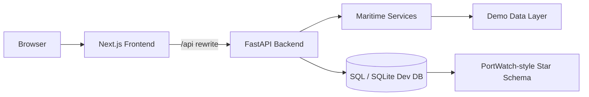

# CTRL SEA - Maritime Intelligence Platform

CTRL SEA is a maritime intelligence platform for monitoring ports, vessels, chokepoints, disruptions, trade exposure, and risk. The project combines a Next.js frontend with a FastAPI backend and a PortWatch-inspired analytical data model.

## Architecture



## Technology Stack

- Frontend: Next.js 15, React 19, TypeScript, Tailwind CSS, React Query, Recharts, Mapbox GL
- Backend: FastAPI, SQLAlchemy, Pydantic, JWT auth
- Data model: Countries, ports, vessels, trade routes, chokepoints, disruptions, climate risk, trade risk
- Deployment targets: Vercel or Netlify for frontend; Render or Railway for backend; Cloudflare Tunnel for previews

## Repository Structure

```text
ctrl-sea-frontend/
  src/app/          Next.js App Router pages
  src/components/   UI, layout, charts, map, dashboard components
  src/lib/          API client, auth, shared types and utilities
  src/features/     Feature modules for future domain isolation
  src/services/     Frontend service abstractions
  src/hooks/        Shared React hooks
  src/constants/    Shared constants
  src/utils/        Shared utilities
  public/           Public brand and PWA assets
  tests/            Frontend tests
  docs/             Frontend documentation

ctrl-sea-backend/
  app/api/          FastAPI routers and dependencies
  app/services/     Domain/data services
  app/repositories/ Repository layer placeholder
  app/models/       SQLAlchemy models
  app/schemas/      Pydantic schemas
  app/core/         Config, logging, security
  app/middleware/   Middleware layer placeholder
  app/database/     Database session and initialization
  app/utils/        Shared backend utilities
  app/tests/        Backend tests
  migrations/       Database migrations
  docs/             Backend documentation

docs/               Product and operations documentation
architecture/       Architecture diagrams and decision notes
screenshots/        Curated screenshots for documentation
```

## Local Development

### Frontend

```powershell
cd ctrl-sea-frontend
copy .env.example .env.local
npm install
npm run dev
```

### Backend

```powershell
cd ctrl-sea-backend
copy .env.example .env
python -m venv .venv
.\.venv\Scripts\activate
pip install -r requirements.txt
uvicorn app.main:app --reload --host 127.0.0.1 --port 8000
```

Frontend defaults to `/api`, with Next.js rewriting requests to `BACKEND_API_URL`.

## Environment Variables

Frontend:

```text
NEXT_PUBLIC_API_URL=/api
BACKEND_API_URL=http://127.0.0.1:8000/api
NEXT_PUBLIC_MAPBOX_TOKEN=your-mapbox-public-token
```

Backend:

```text
APP_NAME=CTRL SEA API
ENVIRONMENT=development
DATABASE_URL=sqlite:///./ctrl_sea_dev.db
JWT_SECRET=replace-with-a-long-random-secret
JWT_ALGORITHM=HS256
ACCESS_TOKEN_EXPIRE_MINUTES=1440
CORS_ORIGINS=http://localhost:3000,http://127.0.0.1:3000
SEED_ADMIN_ENABLED=false
SEED_ADMIN_EMAIL=admin@example.com
SEED_ADMIN_PASSWORD=replace-with-a-local-password
SEED_ADMIN_NAME=CTRL SEA Admin
```

Never commit real `.env` files, JWT secrets, admin passwords, API keys, database files, logs, or tunnel URLs.

## Quality Checks

```powershell
cd ctrl-sea-frontend
npm run lint
npm run build

cd ..\ctrl-sea-backend
python -m compileall app scripts
```

## Deployment

- Frontend: deploy `ctrl-sea-frontend` to Vercel or Netlify.
- Backend: deploy `ctrl-sea-backend` to Render or Railway.
- Set production `JWT_SECRET`, `DATABASE_URL`, and `CORS_ORIGINS` in provider secrets.
- Prefer a persistent domain or named Cloudflare Tunnel for preview/proxy use. Temporary `trycloudflare.com` URLs are not production-stable.

## Screenshots

Place curated, compressed product screenshots in `screenshots/`. Generated local screenshots are ignored by default.
