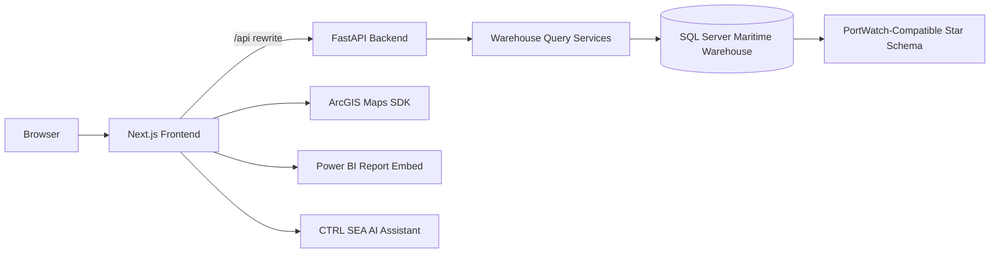

# CTRL SEA - Maritime Intelligence Platform

CTRL SEA is an enterprise maritime intelligence platform for monitoring ports, countries, chokepoints, disruptions, trade exposure, climate risk, Power BI reports, AI-assisted analysis, and ArcGIS-powered geospatial intelligence. The project combines a Next.js frontend with a FastAPI backend and a SQL Server maritime analytics warehouse.

## Architecture



## Technology Stack

- Frontend: Next.js 15, React 19, TypeScript, Tailwind CSS, React Query, Recharts, ArcGIS Maps SDK, Power BI embed components
- Backend: FastAPI, SQLAlchemy, Pydantic, JWT auth, Google OAuth integration hooks
- Data model: Countries, ports, vessels, trade routes, chokepoints, disruptions, climate risk, trade risk
- Deployment targets: Vercel for frontend; Render, Railway, Azure App Service, or Docker for backend; Docker Compose for local full-stack runs

## Features

- Executive command dashboard with KPIs, status telemetry, filters, alerts, and searchable operational entities.
- ArcGIS-powered maritime map and premium login globe experience.
- Port, country, chokepoint, climate-risk, trade-risk, disruption, spillover, and report pages.
- CTRL SEA AI assistant with warehouse-aware fallback responses.
- Power BI dashboard center with local PBIX asset support and embed-ready configuration.
- FastAPI service layer over SQL Server warehouse analytics.
- Dockerfiles, Docker Compose, GitHub Actions, security policy, issue templates, and deployment guides.

## Repository Structure

```text
ctrl-sea-frontend/
  src/app/          Next.js App Router pages
  src/components/   UI, layout, charts, map, dashboard components
  src/lib/          API client, auth, shared types and utilities
  src/features/     Feature modules for future domain isolation
  src/services/     Frontend service abstractions
  src/hooks/        Shared React hooks
  src/constants/    Shared constants
  src/utils/        Shared utilities
  public/           Public brand and PWA assets
  tests/            Frontend tests
  docs/             Frontend documentation

ctrl-sea-backend/
  app/api/          FastAPI routers and dependencies
  app/services/     Domain/data services
  app/repositories/ Repository layer placeholder
  app/models/       SQLAlchemy models
  app/schemas/      Pydantic schemas
  app/core/         Config, logging, security
  app/middleware/   Middleware layer placeholder
  app/database/     Database session and initialization
  app/utils/        Shared backend utilities
  app/tests/        Backend tests
  migrations/       Database migrations
  docs/             Backend documentation

docs/               Product and operations documentation
architecture/       Architecture diagrams and decision notes
deployment/         GitHub, Vercel, Render/Railway, Azure, and Docker deployment guides
database/           Database documentation entry point
docker/             Docker documentation entry point
.github/            Workflows, issue templates, and pull request template
screenshots/        Curated screenshots for documentation
```

## Local Development

### One-command startup on Windows

```bat
start-all.bat
```

This validates local configuration and SQL Server, selects free ports, injects the backend URL into Next.js, waits for both health checks, and stores logs and process IDs under `.runtime/`.

Stop both services with:

```bat
stop-all.bat
```

See the [complete local development workflow](docs/local-development.md) for first-time setup, automatic recovery behavior, Docker Compose, logs, and troubleshooting.

### Frontend

```powershell
cd ctrl-sea-frontend
copy .env.example .env.local
npm install
npm run dev
```

### Backend

```powershell
cd ctrl-sea-backend
copy .env.example .env
python -m venv .venv
.\.venv\Scripts\activate
pip install -r requirements.txt
uvicorn app.main:app --reload --host 127.0.0.1 --port 8000
```

Frontend defaults to `/api`, with Next.js rewriting requests to `BACKEND_API_URL`.

## Environment Variables

Frontend:

```text
NEXT_PUBLIC_API_URL=/api
BACKEND_API_URL=http://127.0.0.1:8000/api
NEXT_PUBLIC_SITE_URL=http://localhost:3000
ARCGIS_API_KEY=replace-with-arcgis-api-key-if-required
```

Backend:

```text
APP_NAME=CTRL SEA API
ENVIRONMENT=development
DATABASE_URL=mssql+pyodbc://@localhost\SQLEXPRESS/ITI_Graduation_PortWatch?driver=ODBC+Driver+18+for+SQL+Server&trusted_connection=yes&TrustServerCertificate=yes
JWT_SECRET=replace-with-a-long-random-secret
JWT_ALGORITHM=HS256
ACCESS_TOKEN_EXPIRE_MINUTES=30
REFRESH_TOKEN_EXPIRE_DAYS=14
AUTH_COOKIE_SECURE=false
POWER_BI_REPORTS_JSON=[]
GOOGLE_OAUTH_CLIENT_ID=replace-with-google-oauth-client-id
GOOGLE_OAUTH_CLIENT_SECRET=replace-with-google-oauth-client-secret
GOOGLE_OAUTH_REDIRECT_URI=http://localhost:8000/api/auth/google/callback
OPENAI_API_KEY=replace-with-openai-api-key-if-used
POWERBI_CLIENT_ID=replace-with-powerbi-client-id
POWERBI_CLIENT_SECRET=replace-with-powerbi-client-secret
CORS_ORIGINS=http://localhost:3000,http://127.0.0.1:3000
SEED_ADMIN_ENABLED=false
SEED_ADMIN_EMAIL=admin@example.com
SEED_ADMIN_PASSWORD=replace-with-a-local-password
SEED_ADMIN_NAME=CTRL SEA Admin
```

Never commit real `.env` files, JWT secrets, admin passwords, API keys, database files, logs, or tunnel URLs.

## Quality Checks

```powershell
cd ctrl-sea-frontend
npm run lint
npm test
npm run build

cd ..\ctrl-sea-backend
python -m compileall app scripts
python -m pytest -q
```

## Docker Setup

```powershell
copy .env.example .env
copy ctrl-sea-backend\.env.example ctrl-sea-backend\.env
docker compose up --build
```

The frontend is exposed on `http://127.0.0.1:3000` and the backend on `http://127.0.0.1:8000`.

## Database Setup

The backend expects an existing SQL Server warehouse. Start with:

- `ctrl-sea-backend/sql/schema.sql`
- `ctrl-sea-backend/sql/warehouse_performance_indexes.sql`

Use least-privilege SQL credentials in production and keep `DATABASE_URL` in environment secrets.

## Power BI

Power BI report metadata is provided through `POWER_BI_REPORTS_JSON`. Local PBIX assets can live under `ctrl-sea-frontend/public/reports/` for portfolio demonstration, while production embedding should use Azure AD service-principal credentials and backend-issued embed metadata.

## ArcGIS Configuration

The login globe and maritime geospatial experience use ArcGIS Maps SDK for JavaScript. Set `ARCGIS_API_KEY` only when your ArcGIS basemap, services, or organization configuration require it. Do not expose privileged ArcGIS credentials in client-side variables.

## Deployment

- Frontend: deploy `ctrl-sea-frontend` to Vercel or Netlify.
- Backend: deploy beside a reachable SQL Server instance. Windows Authentication to `localhost\SQLEXPRESS` requires the API process to run inside the same Windows trust boundary.
- Set production `JWT_SECRET`, `DATABASE_URL`, and `CORS_ORIGINS` in provider secrets.
- Prefer a persistent domain or named Cloudflare Tunnel for preview/proxy use. Temporary `trycloudflare.com` URLs are not production-stable.

See the deployment guides in `deployment/` for GitHub, Vercel, Render/Railway, Azure App Service, and Docker.

## Screenshots

Place curated, compressed product screenshots in `screenshots/`. Generated local screenshots are ignored by default.

## Roadmap

- Add production Power BI embed-token service and row-level security synchronization.
- Add WebSocket push updates for alerts, KPIs, and map layer refreshes.
- Add scheduled warehouse ingestion jobs and data quality scorecards.
- Add end-to-end browser tests for dashboard, map, AI, and reports.
- Add release versioning and changelog automation.

## Contributors

Maintained by the CTRL SEA project team. Contributions should follow `CONTRIBUTING.md`, `CODE_OF_CONDUCT.md`, and `SECURITY.md`.

## License

MIT. See `LICENSE`.
