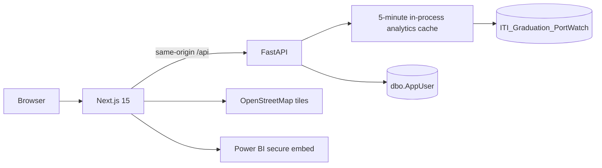

# CTRL SEA Runtime Architecture

Authentication uses rotating access and refresh JWTs stored only in HTTP-only cookies. Next middleware blocks anonymous protected-page requests; FastAPI remains the authorization authority and applies role checks to admin APIs.

The warehouse service queries the fourteen `portwatch_dw` tables directly. Current-state queries use recent windows and present-risk scenarios, pagination limits list endpoints, large responses are gzip-compressed, and cache request coalescing prevents duplicate cold scans.

Leaflet, React Leaflet, and MarkerCluster are isolated in a browser-only dynamic chunk. MarkerCluster loads only after Leaflet is assigned to `window.L`.
